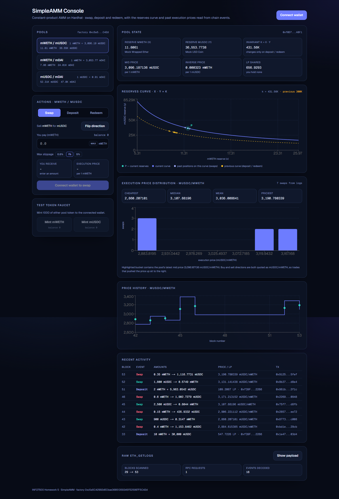

# Homework 5: Simple AMM Web3 UI

## INFO7500 – Cryptocurrency and Smart Contracts

**Student:** Raghavendra Prasath Sridhar

---

# Assignment Overview

Homework 5 puts a web3 UI on top of the `SimpleAMM` contract from Homework 4. A user connects a
wallet, picks a pool, and swaps, deposits, or redeems, while two visualizations update after every
pool action:

1. **Reserves curve** — the `x * y = k` hyperbola with the pool's current point **P** marked. A swap
   slides P along the curve; a deposit or redeem shifts the whole curve.
2. **Distribution of execution prices of past swaps** — a histogram built from historical `Swap`
   events, fetched with raw `eth_getLogs` JSON-RPC calls and decoded in the browser.

The contract was extended (as the assignment allows) so both charts can be built from chain data
alone, and a factory contract was added so the pool list is discovered on-chain instead of being
hardcoded in the UI.

| Requirement | Where it lives |
|---|---|
| Select a pool | [`web/components/PoolSelector.tsx`](web/components/PoolSelector.tsx) via `SimpleAMMFactory.getAllPairs()` |
| Deposit / redeem / swap | [`web/components/ActionPanel.tsx`](web/components/ActionPanel.tsx) and the three forms |
| Reserves curve chart with point P | [`web/components/ReservesCurveChart.tsx`](web/components/ReservesCurveChart.tsx) |
| Execution price distribution of past swaps | [`web/components/PriceDistributionChart.tsx`](web/components/PriceDistributionChart.tsx) |
| Historical data over ETH JSON-RPC | [`web/lib/logs.ts`](web/lib/logs.ts) (`eth_getLogs` + `decodeEventLog`) |
| Contracts on a public testnet | Sepolia, via [`scripts/deploy.js`](scripts/deploy.js) |
| UI on a hosting provider | Vercel (see [Part 5](#part-5--deployment)) |

---

# Environment

| Component | Details |
| --- | --- |
| Host Operating System | Windows 11 |
| Contracts | Solidity `^0.8.20` (compiled with `0.8.28`, optimizer on, 200 runs) |
| Contract framework | Hardhat + `solidity-coverage` |
| Testnet | Ethereum Sepolia (chain id `11155111`) |
| UI framework | Next.js 16 (App Router) + React 19 + TypeScript |
| Web3 libraries | wagmi v3 + viem v2 + TanStack Query v5 |
| Charts | Recharts 3 |
| Styling | Tailwind CSS v4 |
| Hosting | Vercel (UI), Sepolia (contracts) |

---

# Architecture

```text
                         ┌───────────────────────── browser ─────────────────────────┐
                         │  Next.js app (wagmi + viem)                               │
   MetaMask ◀── EIP-1193 │                                                           │
                         │  reads: factory.getAllPairs → pair.poolState → ERC20 meta │
                         │  writes: approve → swap / deposit / redeem                │
                         │  history: eth_getLogs(Swap, Sync, Deposited, Redeemed)    │
                         └───────────────────────────┬───────────────────────────────┘
                                                     │ JSON-RPC (Sepolia)
                    ┌────────────────────────────────▼────────────────────────────────┐
                    │ SimpleAMMFactory                                                │
                    │   allPairs[] · getPair[tokenA][tokenB] · createPair()            │
                    └───────┬─────────────────────┬─────────────────────┬─────────────┘
                            │                     │                     │
                    ┌───────▼───────┐     ┌───────▼───────┐     ┌───────▼───────┐
                    │ SimpleAMM     │     │ SimpleAMM     │     │ SimpleAMM     │
                    │ mWETH/mUSDC   │     │ mWETH/mDAI    │     │ mUSDC/mDAI    │
                    │ x·y=k, LP acct│     │               │     │               │
                    └───────────────┘     └───────────────┘     └───────────────┘
```

The UI never assumes which pools exist: it calls `getAllPairs()` on the factory, reads `tokenA` /
`tokenB` from each pool, and then reads `name`, `symbol`, and `decimals` from each token — the
pattern the assignment hints at with `UniswapV2Factory` / `UniswapV2Pair`.

---

# Part 1 – Contract changes for visualization

## Objective

Make the Homework 4 contract expose enough information for a UI to (a) enumerate pools and (b)
reconstruct historical prices from logs, without an archive node.

## Files

```text
contracts/SimpleAMM.sol          # extended events + view helpers
contracts/SimpleAMMFactory.sol   # new: pool registry
```

## What changed versus Homework 4

| Change | Why the UI needs it |
|---|---|
| `Swap` event now mirrors `UniswapV2Pair.Swap` (`amountAIn`, `amountBIn`, `amountAOut`, `amountBOut`) **and carries post-swap `reserveA` / `reserveB`** | Execution price comes from the amounts; the mid price at that block comes from the reserves. Both from one `eth_getLogs` response. |
| New `Sync(reserveA, reserveB)` event, emitted on every reserve change | Lets the curve chart replay every historical position of P and detect when `k` changed. |
| `LiquidityDeposited` / `LiquidityRedeemed` now carry post-action reserves | The curve chart can show the pool's previous curve after a deposit or redeem. |
| New `poolState(account)` view | One call returns tokens, reserves, LP supply, and the caller's LP balance — one RPC round trip per pool. |
| New `quoteSwap(tokenIn, amountIn)` view | On-chain quote helper for integrators. The UI mirrors the same integer math locally so previews update per keystroke. |
| New `SimpleAMMFactory` (`createPair`, `allPairs`, `allPairsLength`, `getAllPairs`, `getPair`) | Pool discovery without hardcoding addresses in the frontend. |
| Optimizer enabled (`runs = 200`) in `hardhat.config.js` | The factory embeds the pool's creation code, so bytecode size matters. |

The swap event, as emitted:

```solidity
event Swap(
    address indexed sender,
    address indexed to,
    uint256 amountAIn,
    uint256 amountBIn,
    uint256 amountAOut,
    uint256 amountBOut,
    uint256 reserveA,   // after the swap
    uint256 reserveB    // after the swap
);
```

The AMM math itself is unchanged from Homework 4: fee-free constant product,
`amountOut = (amountIn * reserveOut) / (reserveIn + amountIn)`, first LP mints
`sqrt(amountA * amountB)`, later LPs mint `min` of the two reserve ratios.

## Tests and coverage

The Homework 4 suite was updated for the new event signatures and extended with tests for the new
views and the factory:

```text
47 passing
```

| File | Stmts | Branch | Funcs | Lines |
|------|------:|-------:|------:|------:|
| SimpleAMM.sol | 100% | 100% | 100% | 100% |
| SimpleAMMFactory.sol | 100% | 100% | 100% | 100% |
| **All files** | **100%** | **100%** | **100%** | **100%** |

```bash
npm test        # 47 passing
npm run coverage # regenerates coverage/lcov-report/index.html
```

---

# Part 2 – Deploying to Sepolia

## Files

```text
scripts/deploy.js        # deploys, wires, and seeds everything
scripts/export-abis.js   # artifacts -> web/lib/abis.ts
.env.example             # RPC URL + deployer key template
deployments/             # one JSON record per network
```

## Steps

```bash
# 1. configure secrets
cp .env.example .env
#   SEPOLIA_RPC_URL=https://eth-sepolia.g.alchemy.com/v2/...
#   DEPLOYER_PRIVATE_KEY=0x...        (test key, funded from a Sepolia faucet)

# 2. compile + export ABIs for the UI
npm run compile
npm run export-abis

# 3. deploy
npm run deploy:sepolia
```

The script performs a full end-to-end setup so the charts are meaningful on first load:

1. deploys three `MockERC20` tokens (`mWETH`, `mUSDC`, `mDAI`) with a public `mint` used by the UI faucet
2. deploys `SimpleAMMFactory`
3. creates three pools: `mWETH/mUSDC`, `mWETH/mDAI`, `mUSDC/mDAI`
4. seeds liquidity at realistic ratios (for example 10 mWETH : 30,000 mUSDC)
5. executes nine swaps in both directions, then a later deposit, then two more swaps — so the price
   histogram has data **and** the curve chart has a previous curve to show
6. writes `web/lib/deployments.json` and `deployments/<network>-<chainId>.json`, including the
   factory's deployment block (the `fromBlock` for `eth_getLogs`)

Output ends with the three values the frontend needs:

```text
NEXT_PUBLIC_CHAIN_ID=11155111
NEXT_PUBLIC_FACTORY_ADDRESS=0x...
NEXT_PUBLIC_DEPLOY_BLOCK=...
```

Optional Etherscan verification:

```bash
npx hardhat verify --network sepolia <FACTORY_ADDRESS>
npx hardhat verify --network sepolia <POOL_ADDRESS> <TOKEN_A> <TOKEN_B>
```

### Deployed addresses (Sepolia)

| Contract | Address |
|---|---|
| `SimpleAMMFactory` | _fill in after running `npm run deploy:sepolia`_ |
| `mWETH` / `mUSDC` / `mDAI` | _see `deployments/sepolia-11155111.json`_ |
| Pools | _see `deployments/sepolia-11155111.json`_ |

---

# Part 3 – The UI

## Files

```text
web/app/page.tsx                 # dashboard
web/components/*.tsx             # pool selector, forms, charts, tables
web/lib/hooks/usePools.ts        # factory -> pools -> tokens -> reserves
web/lib/hooks/useTxRunner.ts     # approve-then-act transaction sequences
web/lib/amm.ts                   # client-side copy of the contract math
```

## Pool selection

`usePools()` chains three reads and needs no configuration beyond the factory address:

```text
factory.getAllPairs()  ->  [pair, pair, pair]
pair.poolState(user)   ->  (tokenA, tokenB, reserveA, reserveB, totalLP, userLP)
token.name/symbol/decimals
```

Each entry in the selector shows the pair, its mid price, both reserves, and the connected
wallet's LP balance. Reads refresh every 12 seconds and immediately after any transaction.

## Actions

| Tab | Behavior |
|---|---|
| **Swap** | Exact-input swap with a direction toggle, slippage choice (0.5% / 1% / 5%), live `amountOut`, execution price, and price impact. Sends `approve` first only when the allowance is short. |
| **Deposit** | Keeps both inputs matched to the current reserve ratio (an unbalanced deposit would only mint shares for the scarcer side), previews the LP shares minted and the resulting pool share. |
| **Redeem** | Burns LP shares with 25/50/75/100% shortcuts and previews the tokens returned. |

Every write goes through `useTxRunner`, which runs the steps in order, waits for each receipt, then
invalidates all queries — which is what makes the charts update on every pool action. A faucet card
mints 1,000 of either pool token so a grader can trade without hunting for test tokens.

## Chart 1 – reserves curve

Built only from reserves, as the assignment describes:

- `k = reserveA * reserveB` from the live pool state; the solid curve is `y = k / x` sampled over
  140 points around the current reserves
- **P** (the teal, labelled marker) is the pool's current `(reserveA, reserveB)`
- faint dots are historical positions from `Sync` events that satisfy `x * y ≈ k` — the trail P left
  behind as swaps moved it along the *same* curve
- the dashed amber curve is the pool's previous `k`, i.e. the invariant before the most recent
  deposit or redeem, with its own historical points

Because the pool is fee-free, `k` is constant across swaps (up to integer rounding) and only moves
on deposit / redeem. The seeded local deployment shows this precisely — `k` stayed at `300,000`
across five swaps, then jumped to `431,556` after a 2 mWETH deposit:

```text
k series from Sync logs:
300000, 300000, 299999.99999999994, 300000, 299999.99999999994, 300000.00000000006,
431556.0794846615, 431556.07948466146, 431556.07948466146
```

## Chart 2 – distribution of past execution prices

Each historical `Swap` event yields one realized price, normalized to token B per token A so both
trade directions land in the same distribution:

```text
A -> B trade:  executionPrice = amountBOut / amountAIn
B -> A trade:  executionPrice = amountBIn  / amountAOut
mid price after the trade = reserveB / reserveA   (reserves come from the event)
```

The prices are bucketed into up to ten bins and drawn as a histogram, with min / median / mean / max
above it and the bucket containing the latest mid price highlighted. A companion chart plots the same
data against block number, so the step line (mid price) and the dots (realized prices) show the
constant-product slippage of each trade.

---

# Part 4 – Historical data over ETH JSON-RPC

This is the part the assignment calls out as the hard one, so the UI does it explicitly rather than
through a wrapper, and then shows its own work in a **Raw eth_getLogs** panel.

## Making the call

[`web/lib/logs.ts`](web/lib/logs.ts) issues the RPC method directly through viem's transport:

```ts
const rawLogs = await client.request({
  method: "eth_getLogs",
  params: [{
    address: pool,
    topics: [[SWAP, SYNC, LIQUIDITY_DEPOSITED, LIQUIDITY_REDEEMED]], // OR-list of topic0
    fromBlock: numberToHex(chunkStart),
    toBlock: numberToHex(toBlock),
  }],
});
```

Notes on the filter:

- `topics[0]` is the keccak-256 hash of the event signature. Passing an **array** in that slot means
  "any of these events", so one request returns everything the pool emitted.
- `fromBlock` starts at the factory's deployment block, recorded at deploy time.
- The range is walked backwards in 9,500-block chunks (public providers commonly cap `eth_getLogs`
  at 10,000 blocks) with a hard cap on request count; the UI reports when older history was skipped.

Event signature hashes for this contract:

| Event | Signature | topic0 |
|---|---|---|
| `Swap` | `Swap(address,address,uint256,uint256,uint256,uint256,uint256,uint256)` | `0xa5a79273c52413fd319bf0be43c422824dc76fc4f69c671d8805d1aaf3cecc77` |
| `Sync` | `Sync(uint256,uint256)` | `0xcf2aa50876cdfbb541206f89af0ee78d44a2abf8d328e37fa4917f982149848a` |
| `LiquidityDeposited` | `LiquidityDeposited(address,uint256,uint256,uint256,uint256,uint256)` | `0xbe70c413dc395f4e900712d7fa4f21dc5b1f7bb98a0a4aad37d584b4f89fd538` |
| `LiquidityRedeemed` | `LiquidityRedeemed(address,uint256,uint256,uint256,uint256,uint256)` | `0x3e3f1375be9a1690d8fd1059d893f82d0f1742181153dd9e01d1e050795f950a` |

## Decoding the response

A log arrives as hex: `topics[0]` identifies the event, the remaining topics hold the **indexed**
parameters (`sender`, `to`), and `data` holds the non-indexed parameters as consecutive 32-byte
words — exactly what Etherscan's "Logs" tab displays. `decodeEventLog` maps that back onto the ABI:

```ts
const decoded = decodeEventLog({ abi: simpleAmmAbi, data: log.data, topics: log.topics });
// decoded.eventName === "Swap"
// decoded.args === { sender, to, amountAIn, amountBIn, amountAOut, amountBOut, reserveA, reserveB }
```

The panel in the UI prints the outgoing request, one untouched log from the response, the same log
after decoding (including its 32-byte data words), and the topic0 table above — so the RPC layer is
inspectable from the browser.

## Verified locally

Against the seeded local deployment, one request over blocks 29 → 53 returned 18 logs that decoded
into 1 deposit, 6 syncs, and 5 swaps for the `mWETH/mUSDC` pool, with these realized prices:

| Block | Direction | Execution price (mUSDC/mWETH) | Mid price after |
|---:|---|---:|---:|
| 42 | sold mWETH | 2,884.615385 | 2,773.668639 |
| 43 | bought mWETH | 2,860.207101 | 2,949.445562 |
| 44 | sold mWETH | 2,906.221112 | 2,863.630121 |
| 45 | bought mWETH | 3,107.881960 | 3,372.967132 |
| 46 | sold mWETH | 3,171.213152 | 2,981.527083 |

Selling mWETH pushes the mid price down and buying pushes it up, and every execution price sits
between the pre- and post-trade mid prices — the expected constant-product behavior.

### Screenshot – UI against the seeded pools

| Thumbnail | Description |
|---|---|
| [](screenshots/hw5_ui_local_overview.png) | Pool selector (read from the factory), pool state, reserves curve with P and the previous curve, execution-price histogram, price history, decoded activity, and the raw `eth_getLogs` summary. |

---

# Part 5 – Deployment

## Contracts (Sepolia)

```bash
npm run deploy:sepolia
```

## UI (Vercel)

1. Push the repository to GitHub.
2. In Vercel, **Add New Project** → import the repo → set **Root Directory** to `web`.
   Framework preset is detected as Next.js; the default build command (`next build`) is correct.
3. Add environment variables:

   | Key | Value |
   |---|---|
   | `NEXT_PUBLIC_CHAIN_ID` | `11155111` |
   | `NEXT_PUBLIC_FACTORY_ADDRESS` | factory address from the deploy output |
   | `NEXT_PUBLIC_DEPLOY_BLOCK` | deployment block from the deploy output |
   | `NEXT_PUBLIC_SEPOLIA_RPC_URL` | optional — see the note below |

4. Deploy, then open the URL with MetaMask on Sepolia.

### On the RPC endpoint

Leaving `NEXT_PUBLIC_SEPOLIA_RPC_URL` unset is fine: wagmi then uses viem's built-in public Sepolia
endpoint, which needs no account or API key. That endpoint caps `eth_getLogs` at a 1,000-block window,
so `fetchPoolHistory` starts with a 9,500-block window and narrows it (÷4, floor 500) the first time a
provider rejects the range, then keeps the working size for the remaining chunks. A fresh deployment is
therefore read in ~10 requests with no configuration.

Setting the variable to a keyed endpoint (Alchemy/Infura free tier) only makes history cheaper — the
whole range comes back in a single request. Note that not every keyless endpoint works: some, such as
`ethereum-sepolia-rpc.publicnode.com`, serve only the chain head and reject historical log queries
outright. The fetcher surfaces that as an explicit message rather than an empty chart.

**Live URL:** _fill in after deploying to Vercel_

---

# Repository layout

```text
automated-market-maker/
│
├── README.md                     # Homework 4 write-up
├── HOMEWORK5.md                  # this document
├── hardhat.config.js             # optimizer + sepolia network
├── .env.example                  # deploy secrets template
│
├── contracts/
│   ├── SimpleAMM.sol             # AMM with Uniswap-style Swap/Sync events
│   ├── SimpleAMMFactory.sol      # pool registry for UI discovery
│   ├── MockERC20.sol             # test token with public mint
│   └── test/MathHarness.sol      # internal-math coverage helper
│
├── test/
│   ├── SimpleAMM.test.js
│   └── SimpleAMMFactory.test.js
│
├── scripts/
│   ├── deploy.js                 # deploy + seed + write deployment records
│   └── export-abis.js            # artifacts -> web/lib/abis.ts
│
├── deployments/                  # per-network address records
├── coverage/                     # Istanbul HTML report (100%)
│
└── web/                          # Next.js UI (deployed to Vercel)
    ├── app/                      # layout, providers, dashboard page
    ├── components/               # forms, charts, tables
    └── lib/                      # abis, wagmi config, eth_getLogs, hooks
```

## Commands

| Command | Run from | Description |
|---|---|---|
| `npm test` | root | Hardhat test suite (47 tests) |
| `npm run coverage` | root | 100% coverage HTML report |
| `npm run node` | root | Local Hardhat JSON-RPC node |
| `npm run deploy:local` | root | Deploy + seed against the local node |
| `npm run deploy:sepolia` | root | Deploy + seed on Sepolia |
| `npm run export-abis` | root | Regenerate `web/lib/abis.ts` |
| `npm run dev` | `web/` | UI development server |
| `npm run build` | `web/` | Production build |

---

# Submission checklist

| # | Requirement | Status |
|---|---|---|
| 1 | Web3 UI for the Homework 4 AMM | `web/` (Next.js + wagmi/viem) |
| 2 | Pool selection | Read from `SimpleAMMFactory.getAllPairs()` |
| 3 | Deposit / redeem / swap | `ActionPanel` with approvals and slippage |
| 4 | Reserves curve chart with point P | `ReservesCurveChart` |
| 5 | Execution price distribution of past swaps | `PriceDistributionChart` from `eth_getLogs` |
| 6 | Contracts on a public testnet | Sepolia — _add addresses above_ |
| 7 | UI on a hosting provider | Vercel — _add URL above_ |

---

# Learning Outcomes

* Designing contract events for the client: carrying post-action reserves turns a price history that
  would need archive state queries into a single log query
* Factory-based discovery, so a frontend enumerates markets instead of hardcoding them
* Making raw `eth_getLogs` calls, including topic OR-filters and chunked block ranges for public RPC limits
* Decoding ABI-encoded logs (indexed topics versus data words) back into typed events
* Visualizing constant-product mechanics: P sliding along a fixed curve on swaps, the curve shifting
  on liquidity changes, and slippage as the gap between execution and mid price
* Wiring a wallet flow end to end: allowance checks, sequenced `approve` → action transactions,
  receipt waiting, and cache invalidation so the charts stay in sync

---

# Conclusion

Homework 5 delivers a working web3 console for the Homework 4 AMM: pools are discovered from an
on-chain factory, swaps/deposits/redeems execute from the browser with slippage protection, and both
required visualizations are driven by chain data — the `x * y = k` curve with the live point P from
the reserves, and the distribution of past execution prices from `Swap` events retrieved with raw
`eth_getLogs` calls. The contract changes that made this possible (Uniswap-style `Swap` with
reserves, `Sync`, and the factory) are covered by 47 tests at 100% statement and branch coverage.
