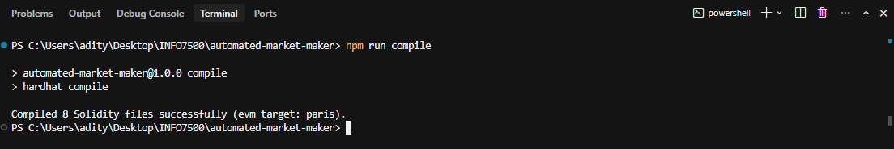
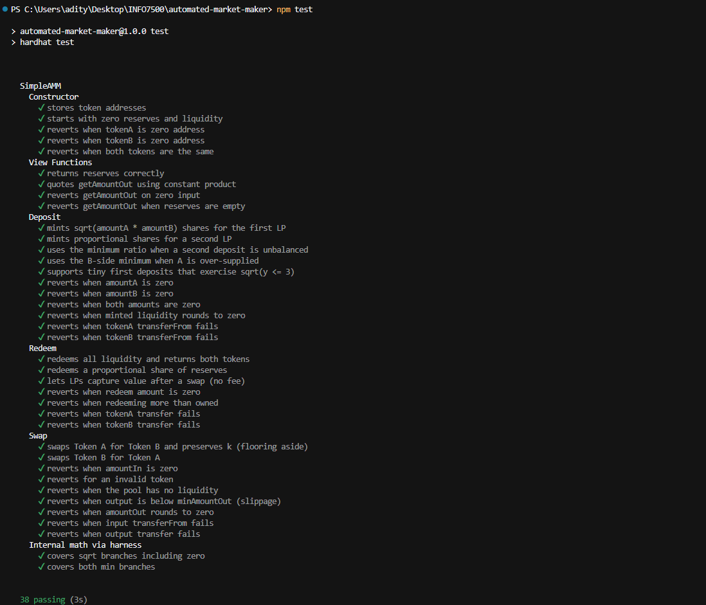
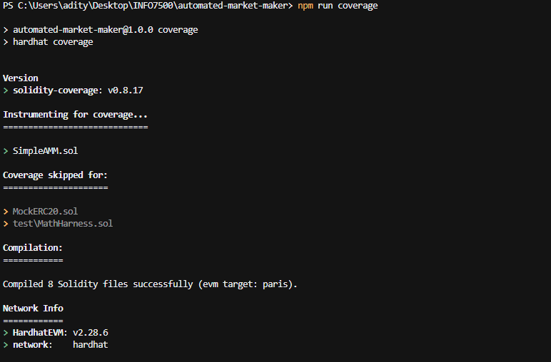
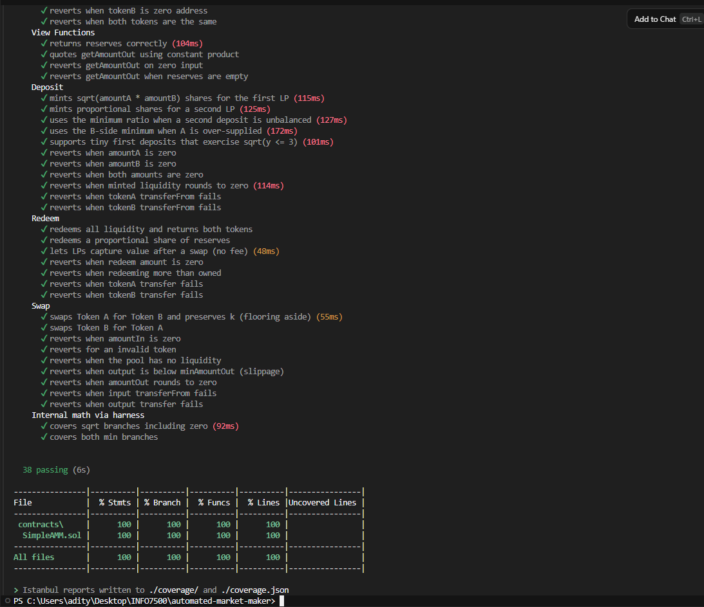
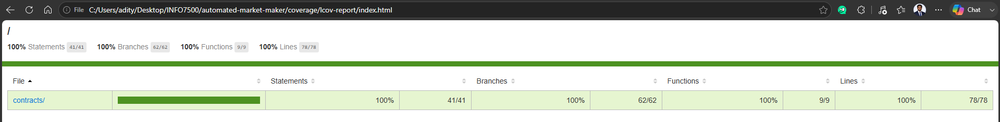

# Homework 4: Simple Automated Market Maker

## INFO7500 – Cryptocurrency and Smart Contracts

**Student:** Raghavendra Prasath Sridhar

---

# Assignment Overview

This assignment implements a simplified **Uniswap V2-style Automated Market Maker (AMM)** in Solidity. The pool holds a pair of ERC-20 tokens and supports liquidity provision and constant-product swaps based on the lecture model of a **pair / pool** with:

1. Atomic Token A
2. Atomic Token B
3. Minted liquidity shares (LP accounting)

The objective was to:

1. Implement `deposit`, `redeem`, and `swap` on a single pair contract
2. Follow Uniswap V2 intuition: first LP mints `sqrt(amountA * amountB)`; later LPs mint the min of both reserve ratios; swaps preserve `x * y = k`
3. Write comprehensive Hardhat tests covering happy paths and every revert / branch
4. Achieve **100% line and 100% branch coverage** and produce an **HTML coverage report**

The contract under test is [`contracts/SimpleAMM.sol`](contracts/SimpleAMM.sol).

---

# Environment

| Component             | Details                                      |
| --------------------- | -------------------------------------------- |
| Host Operating System | Windows 11                                   |
| Runtime               | Node.js + npm                                |
| Smart contract language | Solidity `^0.8.20` (Hardhat `0.8.28`)      |
| Framework             | Hardhat                                      |
| Testing               | Hardhat + Chai                               |
| Coverage              | `solidity-coverage` (Istanbul HTML report)   |
| Token standard        | OpenZeppelin ERC-20 (`@openzeppelin/contracts`) |
| Project path          | `INFO7500/automated-market-maker`            |

---

# Architecture

Constant-product AMM for one token pair:

```text
Liquidity Provider                  Trader
       │                               │
       │ deposit(A, B)                 │ swap(tokenIn, amountIn, minOut)
       ▼                               ▼
┌──────────────────────────────────────────────┐
│                 SimpleAMM                    │
│  tokenA / tokenB (immutable)                 │
│  reserveA / reserveB                         │
│  totalLiquidity / liquidityBalance[user] │
│                                              │
│  deposit → mint LP shares                    │
│  redeem  → burn LP shares, return A + B      │
│  swap    → exact-in, x * y ≈ k               │
└──────────────────────────────────────────────┘
```

**Data flow:** providers deposit both tokens and receive shares → traders swap one token for the other under the constant-product rule → providers redeem shares for a proportional slice of both reserves.

This educational implementation is **fee-free**. Uniswap V2 charges 0.3% on input; a fee would only increase `k` over time for LPs.

---

# Setup

```bash
cd automated-market-maker
npm install
```

### Commands

```bash
npm run compile    # Compile contracts
npm test           # Run the full test suite
npm run coverage   # Generate Istanbul HTML coverage (100% target)
npm run verify     # compile + test + coverage
```

After coverage, open:

- [`coverage/lcov-report/index.html`](coverage/lcov-report/index.html) — HTML overview
- [`coverage/lcov-report/contracts/SimpleAMM.sol.html`](coverage/lcov-report/contracts/SimpleAMM.sol.html) — per-line view

---

# Part 1 – Solidity AMM Contract

## Objective

Implement a complete SimpleAMM with at least `deposit`, `redeem`, and `swap`, using Uniswap V2-style constant-product math and liquidity share accounting.

## Files

```text
contracts/SimpleAMM.sol
contracts/MockERC20.sol
contracts/test/MathHarness.sol
```

## Core API

| Function | Behavior |
|---|---|
| `deposit(amountA, amountB)` | Pulls both tokens; mints LP shares |
| `redeem(liquidity)` | Burns shares; returns proportional Token A and Token B |
| `swap(tokenIn, amountIn, minAmountOut)` | Exact-input swap with slippage protection |
| `getAmountOut(amountIn, reserveIn, reserveOut)` | Pure quote helper |

### Swap math

```text
amountOut = (amountIn * reserveOut) / (reserveIn + amountIn)
```

### First-deposit LP mint

```text
liquidity = sqrt(amountA * amountB)
```

### Later deposits

```text
liquidity = min(
  (amountA * totalLiquidity) / reserveA,
  (amountB * totalLiquidity) / reserveB
)
```

## Beyond the starter sketch

- Immutable token pair + constructor validation
- Liquidity share accounting (`totalLiquidity` / `liquidityBalance`)
- Slippage protection via `minAmountOut`
- Events, custom errors, and NatSpec
- `getAmountOut` quote helper

### Screenshot – Compilation

| Thumbnail | Description |
|---|---|
| [](screenshots/compile_success.png) | `npm run compile` — Hardhat compiled 8 Solidity files successfully (EVM target: paris). |

---

# Part 2 – Comprehensive Tests

## Objective

Write Hardhat tests that exercise Uniswap V2-style AMM behavior and every important revert path so the suite is submission-ready and supports full coverage.

## Files

```text
test/SimpleAMM.test.js
```

## Result

```text
38 passing
```

Test groups:

| Suite | What it covers |
|---|---|
| Constructor | Token storage, zero start state, invalid addresses / identical tokens |
| View functions | `getReserves`, `getAmountOut`, empty-reserve / zero-input reverts |
| Deposit | First LP `sqrt` mint, second LP ratios, unbalanced deposits, transfer failures |
| Redeem | Full / partial redeem, value after swap, ownership and transfer reverts |
| Swap | A↔B swaps, invariant `k`, slippage, invalid token, empty pool |
| Internal math | `_sqrt` and `_min` branches via `MathHarness` |

### Screenshot – Test Suite

| Thumbnail | Description |
|---|---|
| [](screenshots/test_suite_passing.png) | `npm test` — **38 passing** across Constructor, Views, Deposit, Redeem, Swap, and internal math. |

---

# Part 3 – 100% Coverage & HTML Report

## Objective

Achieve **100% line and 100% branch coverage** on `SimpleAMM.sol` and produce an HTML coverage report for submission.

## Files

```text
.solcover.js
coverage/lcov-report/index.html
coverage/lcov-report/contracts/SimpleAMM.sol.html
```

Coverage is scoped to `SimpleAMM.sol`. `MockERC20.sol` and `test/MathHarness.sol` are test infrastructure and are skipped in `.solcover.js`.

## Result

| File | Stmts | Branch | Funcs | Lines |
|------|------:|-------:|------:|------:|
| SimpleAMM.sol | 100% | 100% | 100% | 100% |
| **All files** | **100%** | **100%** | **100%** | **100%** |

Measured totals from the HTML report: **41/41** statements, **62/62** branches, **9/9** functions, **78/78** lines.

### Screenshot – Coverage (CLI)

| Thumbnail | Description |
|---|---|
| [](screenshots/coverage_terminal_1.png) | `npm run coverage` — `solidity-coverage` instruments `SimpleAMM.sol` and skips mocks/harness. |
| [](screenshots/coverage_terminal_2.png) | Coverage run finished: **38 passing** and **100%** stmts / branch / funcs / lines on `SimpleAMM.sol`. |

### Screenshot – Coverage (HTML Report)

| Thumbnail | Description |
|---|---|
| [](screenshots/coverage_html_overview.png) | Istanbul HTML report at `coverage/lcov-report/index.html` — **100%** across statements, branches, functions, and lines. |

---

# Deliverables

This folder contains:

```text
automated-market-maker/
│
├── README.md
├── LICENSE
├── package.json
├── hardhat.config.js
├── .solcover.js
│
├── contracts/
│   ├── SimpleAMM.sol              # Complete AMM contract (submit)
│   ├── MockERC20.sol              # Test ERC-20
│   └── test/
│       └── MathHarness.sol        # Internal math coverage helper
│
├── test/
│   └── SimpleAMM.test.js          # Comprehensive Hardhat tests (submit)
│
├── coverage/
│   ├── index.html
│   └── lcov-report/
│       ├── index.html             # HTML coverage report (submit)
│       └── contracts/
│           └── SimpleAMM.sol.html
│
└── screenshots/                   # Submission proof screenshots
    ├── compile_success.png
    ├── test_suite_passing.png
    ├── coverage_terminal_1.png
    ├── coverage_terminal_2.png
    └── coverage_html_overview.png
```

### Submission checklist

| # | Requirement | Location |
|---|---|---|
| 1 | Complete Solidity contract | [`contracts/SimpleAMM.sol`](contracts/SimpleAMM.sol) |
| 2 | Comprehensive tests (100% line & branch) | [`test/SimpleAMM.test.js`](test/SimpleAMM.test.js) |
| 3 | HTML coverage report | [`coverage/lcov-report/index.html`](coverage/lcov-report/index.html) |

---

# Learning Outcomes

This assignment provided practical experience with:

* Uniswap V2-style constant-product AMMs (`x * y = k`)
* Liquidity share minting and redemption accounting
* Exact-input swaps with slippage protection (`minAmountOut`)
* Hardhat testing of happy paths and custom-error reverts
* Achieving and documenting 100% statement and branch coverage
* Producing an Istanbul / `solidity-coverage` HTML report for submission

---

# Conclusion

Homework 4 implements a simplified Uniswap V2-style AMM with `deposit`, `redeem`, and `swap`, backed by **38 passing tests** and **100% statement, branch, function, and line coverage** on `SimpleAMM.sol`. The HTML coverage report under `coverage/lcov-report/` is ready for submission together with the contract and test suite.
