# Simple Automated Market Maker — Homework 4 & 5

## INFO7500 – Cryptocurrency and Smart Contracts

**Student:** Raghavendra Prasath Sridhar

This repository holds two assignments built on the same constant-product AMM:

| Homework | Deliverable | Section |
|---|---|---|
| **4** | `SimpleAMM` in Solidity with `deposit` / `redeem` / `swap`, a full Hardhat suite, and 100% line & branch coverage | [Homework 4](#homework-4-simple-automated-market-maker) |
| **5** | A web3 UI for that AMM — pool selection, the three actions, the `x · y = k` reserves curve, and the distribution of past execution prices from `eth_getLogs` | [Homework 5](#homework-5-simple-amm-web3-ui) |

Homework 5 extended the contract (a Uniswap-style `Swap` event carrying reserves, a `Sync` event,
`poolState` / `quoteSwap` views, and a `SimpleAMMFactory`), so the suite is now **47 passing** at 100%
coverage rather than the 38 described in the Homework 4 sections below. Everything about both
assignments — contracts, tests, coverage, UI, log decoding, and deployment — is in this one document.

**Live UI:** _fill in after deploying to Vercel_

[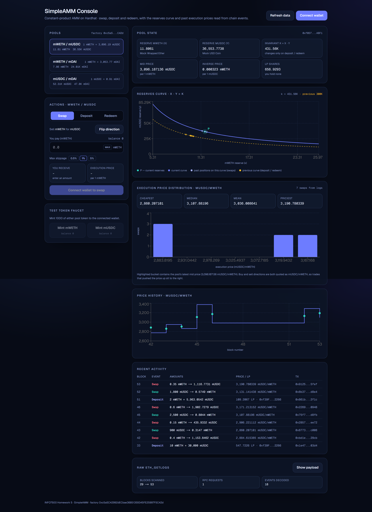](screenshots/hw5_ui_dashboard.png)

## Quick start

```bash
npm install                # contracts (repo root)
npm test                   # 47 passing
npm run coverage           # 100% line & branch HTML report

npm run node               # terminal 1: local Hardhat chain
npm run deploy:local       # terminal 2: deploy + seed 3 pools with swap history

cd web && npm install
npm run dev                # http://localhost:3000 (set NEXT_PUBLIC_CHAIN_ID=31337)
```

The local deploy seeds liquidity, a run of swaps, and a later deposit, so both charts have real history
the moment the UI opens.

---

# Homework 4: Simple Automated Market Maker

# Assignment Overview (Homework 4)

This assignment implements a simplified **Uniswap V2-style Automated Market Maker (AMM)** in Solidity. The pool holds a pair of ERC-20 tokens and supports liquidity provision and constant-product swaps based on the lecture model of a **pair / pool** with:

1. Atomic Token A
2. Atomic Token B
3. Minted liquidity shares (LP accounting)

The objective was to:

1. Implement `deposit`, `redeem`, and `swap` on a single pair contract
2. Follow Uniswap V2 intuition: first LP mints `sqrt(amountA * amountB)`; later LPs mint the min of both reserve ratios; swaps preserve `x * y = k`
3. Write comprehensive Hardhat tests covering happy paths and every revert / branch
4. Achieve **100% line and 100% branch coverage** and produce an **HTML coverage report**

The contract under test is [`contracts/SimpleAMM.sol`](contracts/SimpleAMM.sol).

---

# Environment (Homework 4)

| Component             | Details                                      |
| --------------------- | -------------------------------------------- |
| Host Operating System | Windows 11                                   |
| Runtime               | Node.js + npm                                |
| Smart contract language | Solidity `^0.8.20` (Hardhat `0.8.28`)      |
| Framework             | Hardhat                                      |
| Testing               | Hardhat + Chai                               |
| Coverage              | `solidity-coverage` (Istanbul HTML report)   |
| Token standard        | OpenZeppelin ERC-20 (`@openzeppelin/contracts`) |
| Project path          | `INFO7500/automated-market-maker`            |

---

# Architecture (Homework 4)

Constant-product AMM for one token pair:

```text
Liquidity Provider                  Trader
       │                               │
       │ deposit(A, B)                 │ swap(tokenIn, amountIn, minOut)
       ▼                               ▼
┌──────────────────────────────────────────────┐
│                 SimpleAMM                    │
│  tokenA / tokenB (immutable)                 │
│  reserveA / reserveB                         │
│  totalLiquidity / liquidityBalance[user] │
│                                              │
│  deposit → mint LP shares                    │
│  redeem  → burn LP shares, return A + B      │
│  swap    → exact-in, x * y ≈ k               │
└──────────────────────────────────────────────┘
```

**Data flow:** providers deposit both tokens and receive shares → traders swap one token for the other under the constant-product rule → providers redeem shares for a proportional slice of both reserves.

This educational implementation is **fee-free**. Uniswap V2 charges 0.3% on input; a fee would only increase `k` over time for LPs.

---

# Setup (contracts)

```bash
cd automated-market-maker
npm install
```

### Commands

```bash
npm run compile    # Compile contracts
npm test           # Run the full test suite
npm run coverage   # Generate Istanbul HTML coverage (100% target)
npm run verify     # compile + test + coverage
```

After coverage, open:

- [`coverage/lcov-report/index.html`](coverage/lcov-report/index.html) — HTML overview
- [`coverage/lcov-report/contracts/SimpleAMM.sol.html`](coverage/lcov-report/contracts/SimpleAMM.sol.html) — per-line view

---

# Part 1 – Solidity AMM Contract

## Objective

Implement a complete SimpleAMM with at least `deposit`, `redeem`, and `swap`, using Uniswap V2-style constant-product math and liquidity share accounting.

## Files

```text
contracts/SimpleAMM.sol
contracts/MockERC20.sol
contracts/test/MathHarness.sol
```

## Core API

| Function | Behavior |
|---|---|
| `deposit(amountA, amountB)` | Pulls both tokens; mints LP shares |
| `redeem(liquidity)` | Burns shares; returns proportional Token A and Token B |
| `swap(tokenIn, amountIn, minAmountOut)` | Exact-input swap with slippage protection |
| `getAmountOut(amountIn, reserveIn, reserveOut)` | Pure quote helper |

### Swap math

```text
amountOut = (amountIn * reserveOut) / (reserveIn + amountIn)
```

### First-deposit LP mint

```text
liquidity = sqrt(amountA * amountB)
```

### Later deposits

```text
liquidity = min(
  (amountA * totalLiquidity) / reserveA,
  (amountB * totalLiquidity) / reserveB
)
```

## Beyond the starter sketch

- Immutable token pair + constructor validation
- Liquidity share accounting (`totalLiquidity` / `liquidityBalance`)
- Slippage protection via `minAmountOut`
- Events, custom errors, and NatSpec
- `getAmountOut` quote helper

### Screenshot – Compilation

| Thumbnail | Description |
|---|---|
| [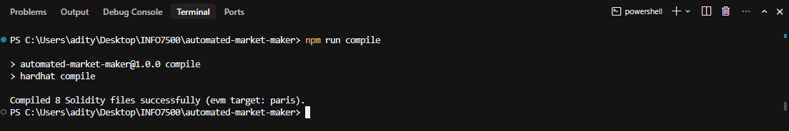](screenshots/compile_success.png) | `npm run compile` — Hardhat compiled 8 Solidity files successfully (EVM target: paris). |

---

# Part 2 – Comprehensive Tests

## Objective

Write Hardhat tests that exercise Uniswap V2-style AMM behavior and every important revert path so the suite is submission-ready and supports full coverage.

## Files

```text
test/SimpleAMM.test.js
```

## Result

```text
38 passing
```

Test groups:

| Suite | What it covers |
|---|---|
| Constructor | Token storage, zero start state, invalid addresses / identical tokens |
| View functions | `getReserves`, `getAmountOut`, empty-reserve / zero-input reverts |
| Deposit | First LP `sqrt` mint, second LP ratios, unbalanced deposits, transfer failures |
| Redeem | Full / partial redeem, value after swap, ownership and transfer reverts |
| Swap | A↔B swaps, invariant `k`, slippage, invalid token, empty pool |
| Internal math | `_sqrt` and `_min` branches via `MathHarness` |

### Screenshot – Test Suite

| Thumbnail | Description |
|---|---|
| [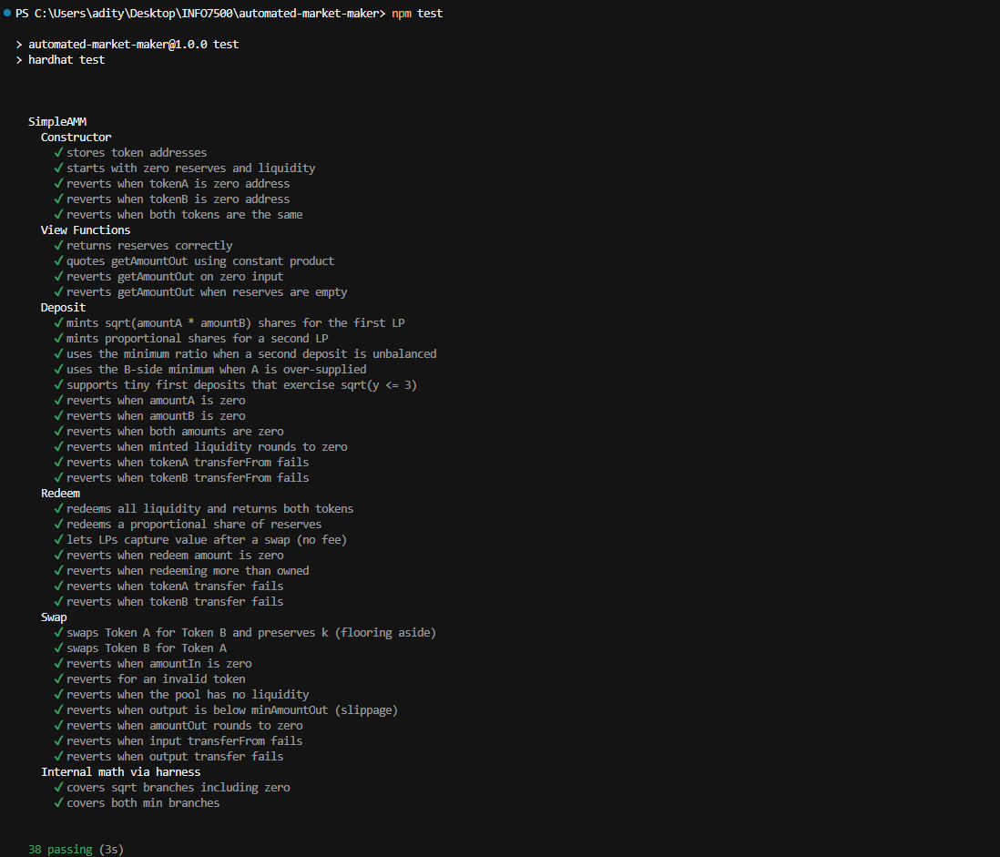](screenshots/test_suite_passing.png) | `npm test` — **38 passing** across Constructor, Views, Deposit, Redeem, Swap, and internal math. |

---

# Part 3 – 100% Coverage & HTML Report

## Objective

Achieve **100% line and 100% branch coverage** on `SimpleAMM.sol` and produce an HTML coverage report for submission.

## Files

```text
.solcover.js
coverage/lcov-report/index.html
coverage/lcov-report/contracts/SimpleAMM.sol.html
```

Coverage is scoped to `SimpleAMM.sol`. `MockERC20.sol` and `test/MathHarness.sol` are test infrastructure and are skipped in `.solcover.js`.

## Result

| File | Stmts | Branch | Funcs | Lines |
|------|------:|-------:|------:|------:|
| SimpleAMM.sol | 100% | 100% | 100% | 100% |
| **All files** | **100%** | **100%** | **100%** | **100%** |

Measured totals from the HTML report: **41/41** statements, **62/62** branches, **9/9** functions, **78/78** lines.

### Screenshot – Coverage (CLI)

| Thumbnail | Description |
|---|---|
| [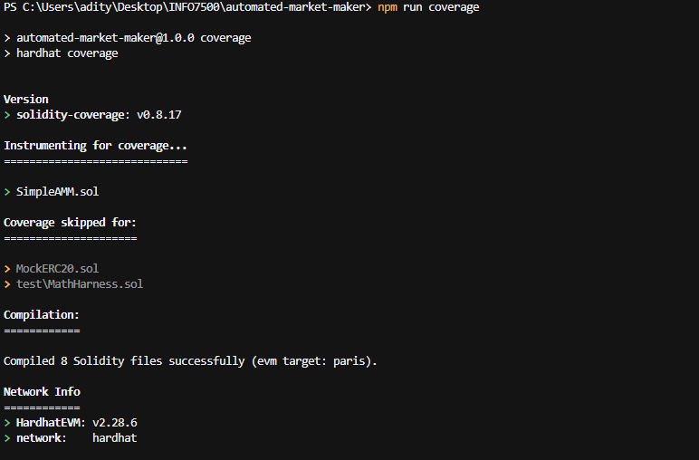](screenshots/coverage_terminal_1.png) | `npm run coverage` — `solidity-coverage` instruments `SimpleAMM.sol` and skips mocks/harness. |
| [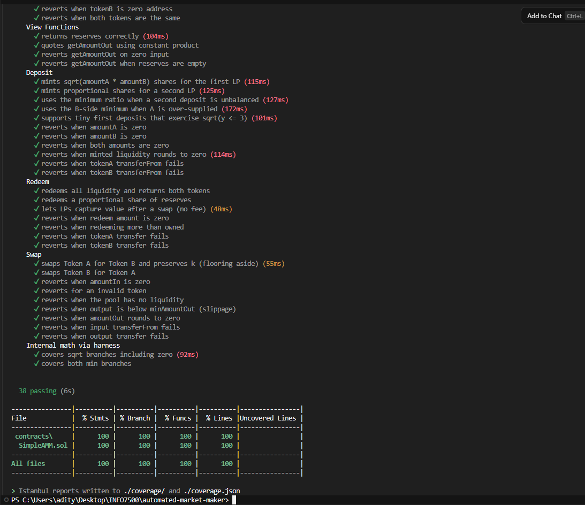](screenshots/coverage_terminal_2.png) | Coverage run finished: **38 passing** and **100%** stmts / branch / funcs / lines on `SimpleAMM.sol`. |

### Screenshot – Coverage (HTML Report)

| Thumbnail | Description |
|---|---|
| [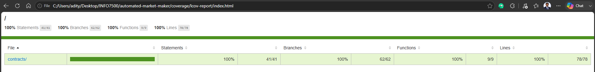](screenshots/coverage_html_overview.png) | Istanbul HTML report at `coverage/lcov-report/index.html` — **100%** across statements, branches, functions, and lines. |

---

# Deliverables (Homework 4)

The Homework 4 submission consists of these files (the repository-wide layout, including the UI, is
[further down](#repository-layout)):

```text
automated-market-maker/
│
├── README.md
├── LICENSE
├── package.json
├── hardhat.config.js
├── .solcover.js
│
├── contracts/
│   ├── SimpleAMM.sol              # Complete AMM contract (submit)
│   ├── MockERC20.sol              # Test ERC-20
│   └── test/
│       └── MathHarness.sol        # Internal math coverage helper
│
├── test/
│   └── SimpleAMM.test.js          # Comprehensive Hardhat tests (submit)
│
├── coverage/
│   ├── index.html
│   └── lcov-report/
│       ├── index.html             # HTML coverage report (submit)
│       └── contracts/
│           └── SimpleAMM.sol.html
│
└── screenshots/                   # Submission proof screenshots
    ├── compile_success.png
    ├── test_suite_passing.png
    ├── coverage_terminal_1.png
    ├── coverage_terminal_2.png
    └── coverage_html_overview.png
```

### Submission checklist

| # | Requirement | Location |
|---|---|---|
| 1 | Complete Solidity contract | [`contracts/SimpleAMM.sol`](contracts/SimpleAMM.sol) |
| 2 | Comprehensive tests (100% line & branch) | [`test/SimpleAMM.test.js`](test/SimpleAMM.test.js) |
| 3 | HTML coverage report | [`coverage/lcov-report/index.html`](coverage/lcov-report/index.html) |

---

# Learning Outcomes (Homework 4)

This assignment provided practical experience with:

* Uniswap V2-style constant-product AMMs (`x * y = k`)
* Liquidity share minting and redemption accounting
* Exact-input swaps with slippage protection (`minAmountOut`)
* Hardhat testing of happy paths and custom-error reverts
* Achieving and documenting 100% statement and branch coverage
* Producing an Istanbul / `solidity-coverage` HTML report for submission

---

# Conclusion (Homework 4)

Homework 4 implements a simplified Uniswap V2-style AMM with `deposit`, `redeem`, and `swap`, backed by **38 passing tests** and **100% statement, branch, function, and line coverage** on `SimpleAMM.sol`. The HTML coverage report under `coverage/lcov-report/` is ready for submission together with the contract and test suite.

---

# Homework 5: Simple AMM Web3 UI

# Assignment Overview (Homework 5)

Homework 5 puts a browser UI on the Homework 4 AMM. A user connects a wallet, picks a pool, and swaps,
deposits, or redeems, while two visualizations refresh after every pool action:

1. **Reserves curve** — the `x · y = k` hyperbola with the pool's current point **P**. A swap slides P
   along the curve; a deposit or redeem shifts the whole curve.
2. **Distribution of execution prices of past swaps** — a histogram of realized prices, recovered from
   historical `Swap` events with raw `eth_getLogs` JSON-RPC calls and decoded in the browser.

The contract was extended (as the assignment permits) so both charts come from chain data alone, and a
factory contract was added so the pool list is discovered on-chain rather than hardcoded.

| Requirement | Where it lives |
|---|---|
| Select a pool | [`web/components/PoolSelector.tsx`](web/components/PoolSelector.tsx), via `SimpleAMMFactory.getAllPairs()` |
| Deposit / redeem / swap | [`web/components/ActionPanel.tsx`](web/components/ActionPanel.tsx) and the three forms |
| Reserves curve chart with point P | [`web/components/ReservesCurveChart.tsx`](web/components/ReservesCurveChart.tsx) |
| Execution price distribution of past swaps | [`web/components/PriceDistributionChart.tsx`](web/components/PriceDistributionChart.tsx) |
| Historical data over ETH JSON-RPC | [`web/lib/logs.ts`](web/lib/logs.ts) — `eth_getLogs` + `decodeEventLog` |
| Contracts on a public testnet | Sepolia, via [`scripts/deploy.js`](scripts/deploy.js) |
| UI on a hosting provider | Vercel — see [Deployment](#part-6--running-locally-and-deploying) |

---

# Environment (Homework 5)

| Component | Details |
|---|---|
| Contracts | Solidity `^0.8.20` (compiled with `0.8.28`, optimizer on, 200 runs) |
| Testnet | Ethereum Sepolia (chain id `11155111`) |
| UI framework | Next.js 16 (App Router) + React 19 + TypeScript |
| Web3 libraries | wagmi v3 + viem v2 + TanStack Query v5 |
| Charts | Recharts 3 |
| Styling | Tailwind CSS v4 |
| Hosting | Vercel (UI), Sepolia (contracts) |

---

# Architecture (Homework 5)

```text
                    ┌───────────────── browser ─────────────────┐
                    │  Next.js app (wagmi + viem)               │
   MetaMask ◀───────│  reads:   getAllPairs → poolState → ERC20 │
        EIP-1193    │  writes:  approve → swap/deposit/redeem   │
                    │  history: eth_getLogs(Swap, Sync, ...)    │
                    └────────────────────┬──────────────────────┘
                                         │ JSON-RPC (Sepolia)
              ┌──────────────────────────▼──────────────────────────┐
              │ SimpleAMMFactory                                    │
              │   allPairs[] · getPair[a][b] · createPair()          │
              └──────┬──────────────────┬──────────────────┬────────┘
                     │                  │                  │
             ┌───────▼──────┐   ┌───────▼──────┐   ┌───────▼──────┐
             │ SimpleAMM    │   │ SimpleAMM    │   │ SimpleAMM    │
             │ mWETH/mUSDC  │   │ mWETH/mDAI   │   │ mUSDC/mDAI   │
             └──────────────┘   └──────────────┘   └──────────────┘
```

The UI never assumes which pools exist: it calls `getAllPairs()`, reads `tokenA` / `tokenB` from each
pool, then reads `name`, `symbol`, and `decimals` from each token — the `UniswapV2Factory` /
`UniswapV2Pair` pattern the assignment hints at.

### Screenshot – Full dashboard

| Thumbnail | Description |
|---|---|
| [](screenshots/hw5_ui_dashboard.png) | The whole console against three seeded pools: pool list from the factory, live pool state, reserves curve with P, execution-price histogram, price history, decoded activity, and the raw `eth_getLogs` panel. |

---

# Part 1 – Contract changes for visualization

## Objective

Expose enough on-chain information for a UI to enumerate pools and rebuild historical prices from logs,
without an archive node.

## Files

```text
contracts/SimpleAMM.sol          # extended events + view helpers
contracts/SimpleAMMFactory.sol   # new: pool registry
```

## What changed versus Homework 4

| Change | Why the UI needs it |
|---|---|
| `Swap` mirrors `UniswapV2Pair.Swap` (`amountAIn`, `amountBIn`, `amountAOut`, `amountBOut`) **and carries post-swap `reserveA` / `reserveB`** | Execution price comes from the amounts and the mid price at that block from the reserves — both out of one `eth_getLogs` response |
| New `Sync(reserveA, reserveB)` on every reserve change | Lets the curve chart replay each historical position of P and spot when `k` moved |
| `LiquidityDeposited` / `LiquidityRedeemed` carry post-action reserves | The curve chart can draw the pool's previous curve |
| New `poolState(account)` view | Tokens, reserves, LP supply, and the caller's LP balance in one round trip |
| New `quoteSwap(tokenIn, amountIn)` view | On-chain quote helper; the UI mirrors the same integer math locally for per-keystroke previews |
| New `SimpleAMMFactory` (`createPair`, `allPairs`, `allPairsLength`, `getAllPairs`, `getPair`) | Pool discovery without hardcoded addresses |
| Optimizer enabled (`runs = 200`) | The factory embeds the pool's creation code, so bytecode size matters |

The swap event, as emitted:

```solidity
event Swap(
    address indexed sender,
    address indexed to,
    uint256 amountAIn,
    uint256 amountBIn,
    uint256 amountAOut,
    uint256 amountBOut,
    uint256 reserveA,   // after the swap
    uint256 reserveB    // after the swap
);
```

The AMM math is unchanged: fee-free constant product, `amountOut = (amountIn * reserveOut) /
(reserveIn + amountIn)`, first LP mints `sqrt(amountA * amountB)`, later LPs mint the `min` of the two
reserve ratios.

## Result

The Homework 4 suite was updated for the new event signatures and extended with tests for the new views
and the factory:

```bash
npm test          # 47 passing
npm run coverage  # regenerates coverage/lcov-report/index.html
```

| File | Stmts | Branch | Funcs | Lines |
|------|------:|-------:|------:|------:|
| SimpleAMM.sol | 100% | 100% | 100% | 100% |
| SimpleAMMFactory.sol | 100% | 100% | 100% | 100% |
| **All files** | **100%** | **100%** | **100%** | **100%** |

---

# Part 2 – Pool selection and actions

## Objective

Let the user pick any pool the factory knows about and run all three pool actions, with allowances and
slippage handled for them.

## Files

```text
web/app/page.tsx                 # dashboard
web/components/*.tsx             # pool selector, forms, charts, tables
web/lib/hooks/usePools.ts        # factory -> pools -> tokens -> reserves
web/lib/hooks/useTxRunner.ts     # approve-then-act transaction sequences
web/lib/amm.ts                   # client-side copy of the contract math
```

## Pool discovery

```text
factory.getAllPairs()  ->  [pair, pair, pair]
pair.poolState(user)   ->  (tokenA, tokenB, reserveA, reserveB, totalLP, userLP)
token.name / symbol / decimals
```

Reads refresh every 12 seconds and immediately after any transaction, so the charts follow every pool
action. Each write goes through `useTxRunner`, which sequences `approve` → action, waits for each
receipt, then invalidates the query cache.

| Tab | Behavior |
|---|---|
| **Swap** | Exact-input swap with a direction toggle, slippage choice (0.5% / 1% / 5%), live `amountOut`, execution price, and price impact. Sends `approve` first only when the allowance is short. |
| **Deposit** | Keeps both inputs matched to the current reserve ratio, previews LP shares minted and the resulting pool share. |
| **Redeem** | Burns LP shares with 25/50/75/100% shortcuts and previews the tokens returned. |

A faucet card mints 1,000 of either pool token, so a grader can trade without hunting for test tokens.

### Screenshot – Pools and pool state

| Thumbnail | Description |
|---|---|
| [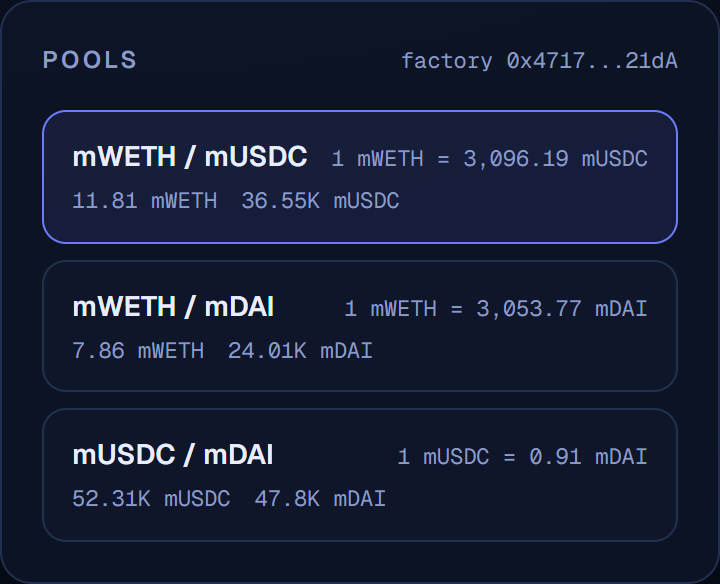](screenshots/hw5_pool_selector.png) | Three pools read from factory `0xc5a5...C42d`, each showing its mid price and both reserves. |
| [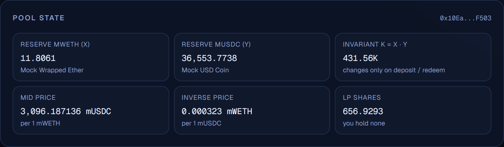](screenshots/hw5_pool_state.png) | Live reserves (11.8061 mWETH / 36,553.7738 mUSDC), the invariant `k = 431.56K`, mid and inverse price, and LP supply. |

### Screenshot – Swap, deposit, redeem

| Thumbnail | Description |
|---|---|
| [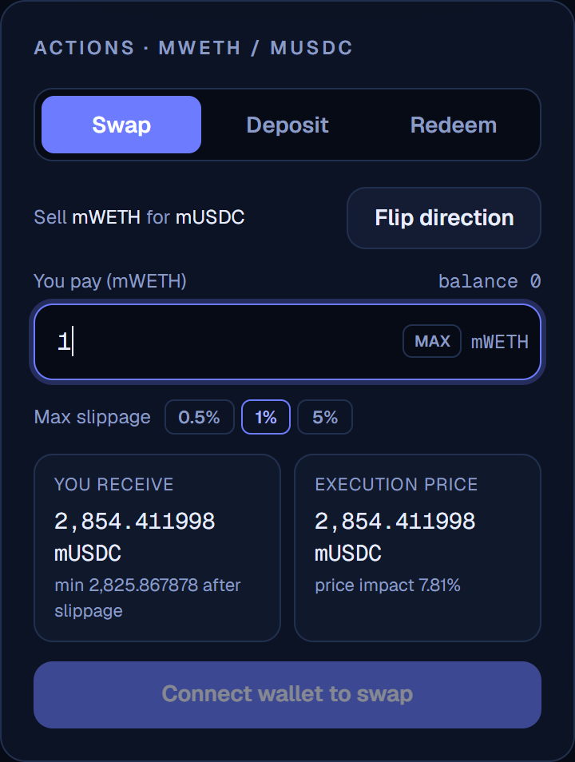](screenshots/hw5_action_swap.png) | 1 mWETH quoted at 2,854.411998 mUSDC — a 7.81% price impact against the 3,096.19 mid price — with the 1% slippage floor shown. |
| [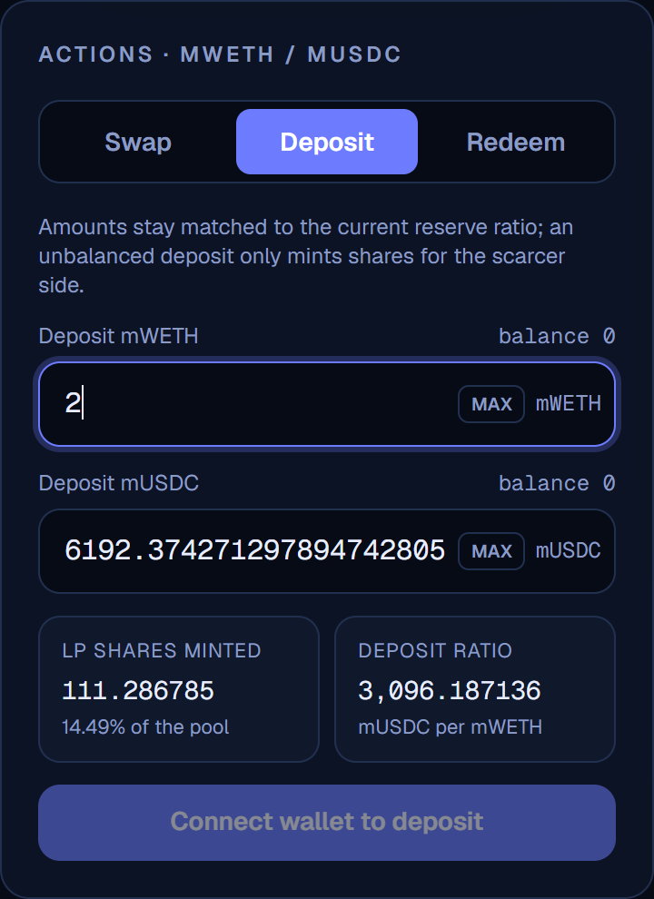](screenshots/hw5_action_deposit.png) | Entering 2 mWETH auto-matches 6,192.374271… mUSDC at the current ratio and previews 111.286785 LP shares, 14.49% of the pool. |
| [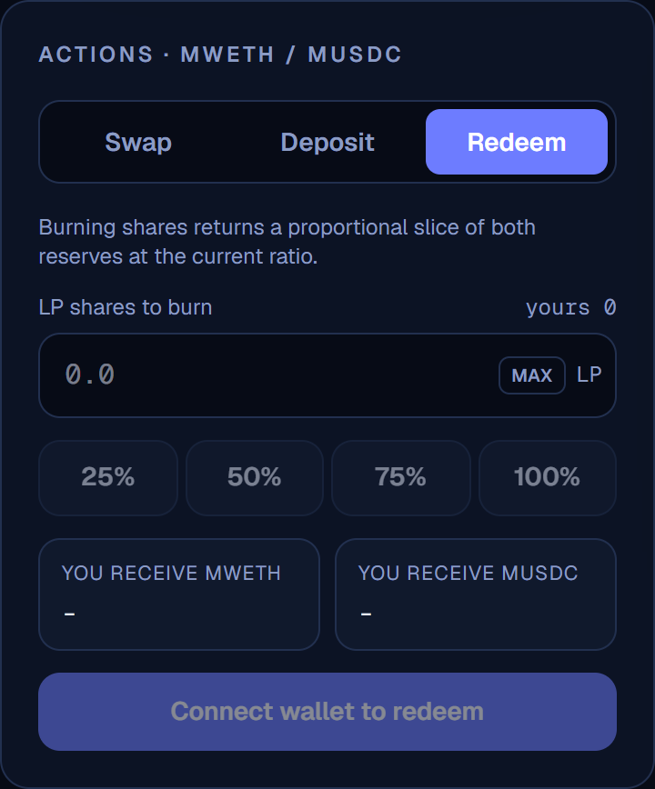](screenshots/hw5_action_redeem.png) | Burning LP shares with percentage shortcuts and a preview of both tokens returned. |

The action buttons read "Connect wallet to …" because these captures are taken headlessly with no
wallet extension; the quotes above them are computed from live reserves either way.

---

# Part 3 – Chart 1: the reserves curve

Built from reserves alone, exactly as the assignment describes:

- `k = reserveA * reserveB` from the live pool state; the solid curve is `y = k / x` sampled over 140
  points around the current reserves
- **P** (the labelled teal marker) is the current `(reserveA, reserveB)`
- faint dots are historical positions from `Sync` events that satisfy `x · y ≈ k` — the trail P left as
  swaps moved it along the *same* curve
- the dashed amber curve is the previous `k`, the invariant before the most recent deposit or redeem

Because the pool is fee-free, `k` only moves on deposit or redeem. The nine `Sync` events of the seeded
deployment show precisely that — `k` held at `300,000` through the opening deposit and five swaps, rose
when 2 mWETH of liquidity was added at block 51, then held again across the final two swaps:

```text
300000, 300000, 300000, 300000, 300000, 300000, 431556.0795, 431556.0795, 431556.0795
```

### Screenshot – Reserves curve

| Thumbnail | Description |
|---|---|
| [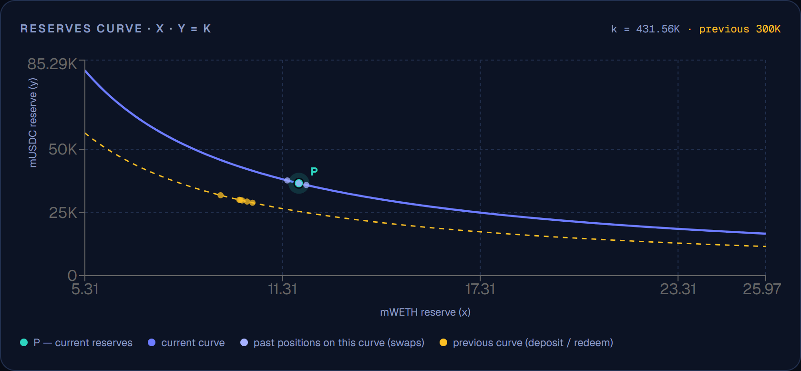](screenshots/hw5_reserves_curve.png) | Current curve (`k = 431.56K`) with P at the live reserves, the swap trail on that curve, and the pool's previous curve (`300K`) dashed in amber. |

---

# Part 4 – Chart 2: distribution of past execution prices

Each historical `Swap` event yields one realized price, normalized to token B per token A so both trade
directions share one distribution:

```text
A -> B trade:  executionPrice = amountBOut / amountAIn
B -> A trade:  executionPrice = amountBIn  / amountAOut
mid price after the trade = reserveB / reserveA      (reserves ride along in the event)
```

Prices are bucketed into up to ten bins, with min / median / mean / max above the histogram and the
bucket holding the latest mid price highlighted. A companion chart plots the same data against block
number, so the step line (mid price) and the dots (realized prices) expose each trade's slippage.

The seven seeded swaps in `mWETH/mUSDC`, read back out of the logs:

| Block | Direction | Amount in | Amount out | Execution price | Mid price after |
|---:|---|---:|---:|---:|---:|
| 42 | sold mWETH | 0.4 mWETH | 1,153.8462 mUSDC | 2,884.615385 | 2,773.668639 |
| 43 | bought mWETH | 900 mUSDC | 0.3147 mWETH | 2,860.207101 | 2,949.445562 |
| 44 | sold mWETH | 0.15 mWETH | 435.9332 mUSDC | 2,906.221112 | 2,863.630121 |
| 45 | bought mWETH | 2,500 mUSDC | 0.8044 mWETH | 3,107.881960 | 3,372.967132 |
| 46 | sold mWETH | 0.6 mWETH | 1,902.7279 mUSDC | 3,171.213152 | 2,981.527083 |
| 52 | bought mWETH | 1,800 mUSDC | 0.5749 mWETH | 3,131.141438 | 3,288.263508 |
| 53 | sold mWETH | 0.35 mWETH | 1,116.7731 mUSDC | 3,190.780339 | 3,096.187136 |

Selling mWETH pushes the mid price down and buying pushes it up, and in all seven trades the execution
price lands between the pre- and post-trade mid prices — the expected constant-product behavior.

### Screenshot – Price distribution, history, and decoded events

| Thumbnail | Description |
|---|---|
| [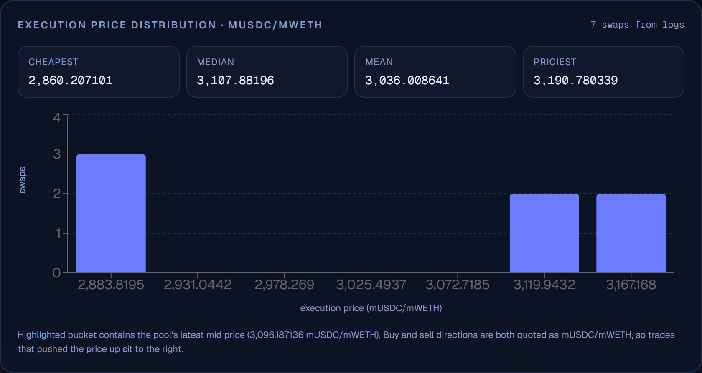](screenshots/hw5_price_distribution.png) | Histogram of the seven realized prices with cheapest 2,860.21, median 3,107.88, mean 3,036.01, priciest 3,190.78. |
| [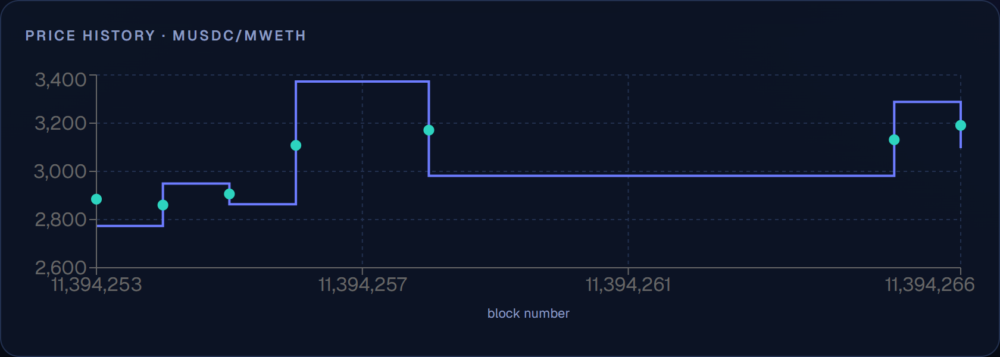](screenshots/hw5_price_history.png) | The same swaps against block number: the step line is the mid price, the dots are realized prices. |
| [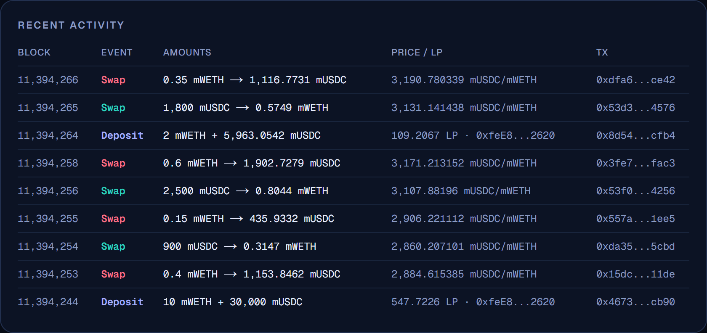](screenshots/hw5_activity_table.png) | Every decoded event — 7 swaps and 2 deposits — with amounts, price or LP shares, and transaction hash. |

---

# Part 5 – Historical data over ETH JSON-RPC

The assignment calls this the hard part, so the UI issues the call itself rather than through a wrapper,
and then shows its own work in a **Raw eth_getLogs** panel.

## Making the call

[`web/lib/logs.ts`](web/lib/logs.ts) issues the RPC method directly through viem's transport:

```ts
const rawLogs = await client.request({
  method: "eth_getLogs",
  params: [{
    address: pool,
    topics: [[SWAP, SYNC, LIQUIDITY_DEPOSITED, LIQUIDITY_REDEEMED]], // OR-list of topic0
    fromBlock: numberToHex(chunkStart),
    toBlock: numberToHex(toBlock),
  }],
});
```

- `topics[0]` is the keccak-256 hash of the event signature; an **array** in that slot means "any of
  these events", so one request returns everything the pool emitted.
- `fromBlock` starts at the factory's deployment block, recorded at deploy time.
- Window width adapts to the provider: it starts at 9,500 blocks and, when an endpoint rejects the
  range, divides by four (floor 500) and retries. A local node or a keyed RPC answers in one request;
  viem's keyless public Sepolia endpoint, which refuses anything over 1,000 blocks, settles at 593.
Event signature hashes for this contract:

| Event | Signature | topic0 |
|---|---|---|
| `Swap` | `Swap(address,address,uint256,uint256,uint256,uint256,uint256,uint256)` | `0xa5a79273c52413fd319bf0be43c422824dc76fc4f69c671d8805d1aaf3cecc77` |
| `Sync` | `Sync(uint256,uint256)` | `0xcf2aa50876cdfbb541206f89af0ee78d44a2abf8d328e37fa4917f982149848a` |
| `LiquidityDeposited` | `LiquidityDeposited(address,uint256,uint256,uint256,uint256,uint256)` | `0xbe70c413dc395f4e900712d7fa4f21dc5b1f7bb98a0a4aad37d584b4f89fd538` |
| `LiquidityRedeemed` | `LiquidityRedeemed(address,uint256,uint256,uint256,uint256,uint256)` | `0x3e3f1375be9a1690d8fd1059d893f82d0f1742181153dd9e01d1e050795f950a` |

## Decoding the response

A log arrives as hex: `topics[0]` identifies the event, the remaining topics hold the **indexed**
parameters (`sender`, `to`), and `data` holds the non-indexed parameters as consecutive 32-byte words —
exactly what Etherscan's "Logs" tab displays. `decodeEventLog` maps that back onto the ABI:

```ts
const decoded = decodeEventLog({ abi: simpleAmmAbi, data: log.data, topics: log.topics });
// decoded.eventName === "Swap"
// decoded.args === { sender, to, amountAIn, amountBIn, amountAOut, amountBOut, reserveA, reserveB }
```

The panel in the UI prints the outgoing request, one untouched log from the response, the same log after
decoding (including its 32-byte data words), and the topic0 table above — so the RPC layer is
inspectable from the browser.

### Screenshot – Raw eth_getLogs

| Thumbnail | Description |
|---|---|
| [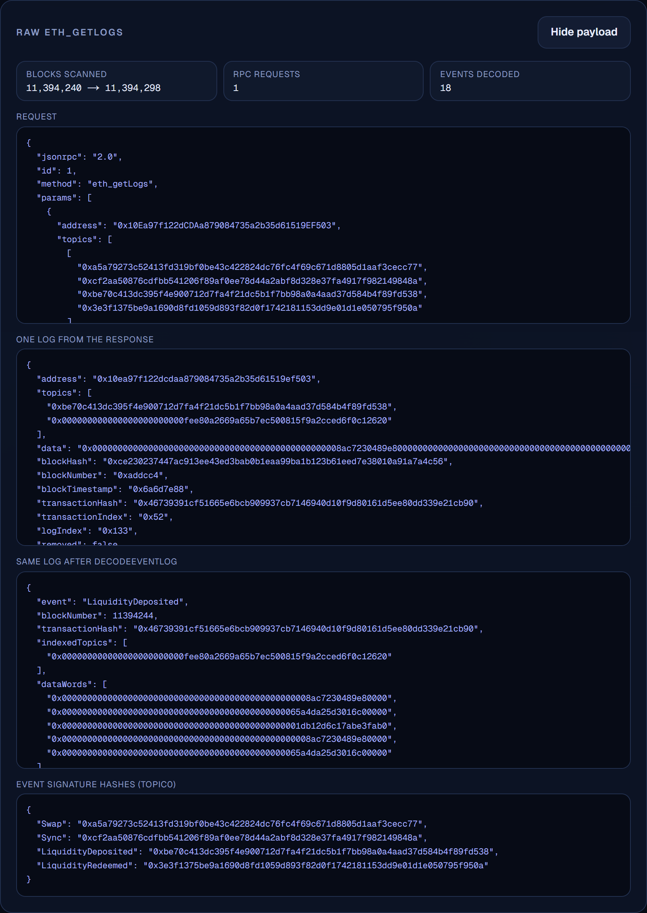](screenshots/hw5_raw_getlogs.png) | One request over blocks 29 → 53 returning 18 decoded events, with the outgoing JSON-RPC payload, an untouched log, the same log after `decodeEventLog` (indexed topics plus data words), and the topic0 table. |

---

# Part 6 – Running locally and deploying

## Local development

```bash
# 1. from the repository root: start a chain and deploy + seed the contracts
npm run node                # terminal 1
npm run deploy:local        # terminal 2 (writes web/lib/deployments.json)

# 2. in web/
cp .env.example .env.local  # set NEXT_PUBLIC_CHAIN_ID=31337 for the local node
npm install
npm run dev                 # http://localhost:3000
```

Point MetaMask at `http://127.0.0.1:8545` (chain id `31337`) and import a Hardhat test key to sign
transactions locally. For Sepolia, set `NEXT_PUBLIC_CHAIN_ID=11155111` and the factory address printed
by `npm run deploy:sepolia`.

### UI environment variables

| Variable | Required | Purpose |
|---|---|---|
| `NEXT_PUBLIC_CHAIN_ID` | no (defaults to Sepolia) | Chain the UI reads from: `11155111` or `31337` |
| `NEXT_PUBLIC_FACTORY_ADDRESS` | no | Overrides the factory from `web/lib/deployments.json` |
| `NEXT_PUBLIC_DEPLOY_BLOCK` | no | `fromBlock` for `eth_getLogs` |
| `NEXT_PUBLIC_SEPOLIA_RPC_URL` | no | Keyed RPC; without it, viem's keyless public Sepolia endpoint is used and log queries are chunked to its 1,000-block limit |

## Deployment files

```text
scripts/deploy.js        # deploys, wires, and seeds everything
scripts/export-abis.js   # artifacts -> web/lib/abis.ts
.env.example             # RPC URL + deployer key template
deployments/             # one JSON record per network
```

## Contracts (Sepolia)

```bash
# 1. configure secrets
cp .env.example .env
#   SEPOLIA_RPC_URL=https://eth-sepolia.g.alchemy.com/v2/...
#   DEPLOYER_PRIVATE_KEY=0x...        (test key, funded from a Sepolia faucet)

# 2. compile + export ABIs for the UI
npm run compile
npm run export-abis

# 3. deploy
npm run deploy:sepolia
```

The script performs a full end-to-end setup so the charts are meaningful on first load:

1. deploys three `MockERC20` tokens (`mWETH`, `mUSDC`, `mDAI`) with a public `mint` used by the UI faucet
2. deploys `SimpleAMMFactory`
3. creates three pools: `mWETH/mUSDC`, `mWETH/mDAI`, `mUSDC/mDAI`
4. seeds liquidity at realistic ratios (for example 10 mWETH : 30,000 mUSDC)
5. executes swaps in both directions, then a later deposit, then more swaps — so the price histogram has
   data **and** the curve chart has a previous curve to show
6. writes `web/lib/deployments.json` and `deployments/<network>-<chainId>.json`, including the factory's
   deployment block (the `fromBlock` for `eth_getLogs`)

Output ends with the three values the frontend needs:

```text
NEXT_PUBLIC_CHAIN_ID=11155111
NEXT_PUBLIC_FACTORY_ADDRESS=0x...
NEXT_PUBLIC_DEPLOY_BLOCK=...
```

Optional Etherscan verification:

```bash
npx hardhat verify --network sepolia <FACTORY_ADDRESS>
npx hardhat verify --network sepolia <POOL_ADDRESS> <TOKEN_A> <TOKEN_B>
```

### Deployed addresses (Sepolia)

| Contract | Address |
|---|---|
| `SimpleAMMFactory` | _fill in after running `npm run deploy:sepolia`_ |
| `mWETH` / `mUSDC` / `mDAI` | _see `deployments/sepolia-11155111.json`_ |
| Pools | _see `deployments/sepolia-11155111.json`_ |

## UI (Vercel)

1. Push the repository to GitHub.
2. In Vercel, **Add New Project** → import the repo → set **Root Directory** to `web`.
   The framework preset is detected as Next.js; the default build command (`next build`) is correct.
3. Add environment variables:

   | Key | Value |
   |---|---|
   | `NEXT_PUBLIC_CHAIN_ID` | `11155111` |
   | `NEXT_PUBLIC_FACTORY_ADDRESS` | factory address from the deploy output |
   | `NEXT_PUBLIC_DEPLOY_BLOCK` | deployment block from the deploy output |
   | `NEXT_PUBLIC_SEPOLIA_RPC_URL` | optional — see the note below |

4. Deploy, then open the URL with MetaMask on Sepolia.

Because `NEXT_PUBLIC_*` values are inlined at build time, changing one in the Vercel dashboard needs a
fresh deployment before it takes effect.

### On the RPC endpoint

Leaving `NEXT_PUBLIC_SEPOLIA_RPC_URL` unset is fine: wagmi then uses viem's built-in public Sepolia
endpoint, which needs no account or API key. That endpoint caps `eth_getLogs` at a 1,000-block window,
so `fetchPoolHistory` starts with a 9,500-block window and narrows it (÷4, floor 500) the first time a
provider rejects the range, then keeps the working size for the remaining chunks. A fresh deployment is
therefore read in ~10 requests with no configuration.

Setting the variable to a keyed endpoint (Alchemy/Infura free tier) only makes history cheaper — the
whole range comes back in a single request. Note that not every keyless endpoint works: some, such as
`ethereum-sepolia-rpc.publicnode.com`, serve only the chain head and reject historical log queries
outright. The fetcher surfaces that as an explicit message rather than an empty chart.

**Live URL:** _fill in after deploying to Vercel_

---

# Repository layout

```text
automated-market-maker/
│
├── README.md                     # this document: Homework 4 + Homework 5
├── hardhat.config.js             # optimizer + sepolia network
├── .solcover.js
├── .env.example                  # deploy secrets template
│
├── contracts/
│   ├── SimpleAMM.sol             # AMM with Uniswap-style Swap/Sync events
│   ├── SimpleAMMFactory.sol      # pool registry for UI discovery
│   ├── MockERC20.sol             # test token with public mint
│   └── test/MathHarness.sol      # internal-math coverage helper
│
├── test/
│   ├── SimpleAMM.test.js
│   └── SimpleAMMFactory.test.js  # 47 passing, 100% coverage
│
├── scripts/
│   ├── deploy.js                 # deploy + seed + write deployment records
│   ├── export-abis.js            # artifacts -> web/lib/abis.ts
│   └── screenshot-ui.js          # regenerates the UI screenshots above
│
├── deployments/                  # per-network address records
├── coverage/                     # Istanbul HTML report (100%)
├── screenshots/                  # submission proof screenshots
│
└── web/                          # Next.js UI (deployed to Vercel)
    ├── app/
    │   ├── layout.tsx            # fonts, metadata, providers
    │   ├── providers.tsx         # WagmiProvider + TanStack Query
    │   └── page.tsx              # dashboard composition
    ├── components/
    │   ├── PoolSelector.tsx      # pools read from SimpleAMMFactory.getAllPairs()
    │   ├── PoolStats.tsx         # reserves, k, mid price, LP share
    │   ├── ActionPanel.tsx       # swap / deposit / redeem tabs
    │   ├── SwapForm.tsx          # exact-in swap with slippage + approvals
    │   ├── DepositForm.tsx       # ratio-matched deposit
    │   ├── RedeemForm.tsx        # burn LP shares
    │   ├── ReservesCurveChart.tsx      # x · y = k with point P
    │   ├── PriceDistributionChart.tsx  # histogram of past execution prices
    │   ├── PriceHistoryChart.tsx       # execution vs mid price over blocks
    │   ├── ActivityTable.tsx     # decoded recent events
    │   ├── RawLogsPanel.tsx      # the eth_getLogs request/response behind the charts
    │   └── FaucetCard.tsx        # mint test tokens
    └── lib/
        ├── abis.ts               # generated by `npm run export-abis`
        ├── deployments.json      # generated by the deploy script
        ├── logs.ts               # raw eth_getLogs + decodeEventLog + histogram math
        ├── amm.ts                # client-side mirror of the contract math
        └── hooks/                # pool discovery, history, transaction runner
```

## Commands

| Command | Run from | Description |
|---|---|---|
| `npm test` | root | Hardhat suite (47 tests) |
| `npm run coverage` | root | 100% coverage HTML report |
| `npm run node` | root | Local Hardhat JSON-RPC node |
| `npm run deploy:local` | root | Deploy + seed against the local node |
| `npm run deploy:sepolia` | root | Deploy + seed on Sepolia |
| `npm run export-abis` | root | Regenerate `web/lib/abis.ts` |
| `npm run screenshots` | root | Recapture the UI screenshots (needs the local stack running) |
| `npm run dev` | `web/` | UI development server |
| `npm run build` | `web/` | Production build |
| `npm start` | `web/` | Serve the production build |
| `npm run lint` | `web/` | ESLint |

## Submission checklist

| # | Requirement | Status |
|---|---|---|
| 1 | Web3 UI for the Homework 4 AMM | [`web/`](web) — Next.js + wagmi/viem |
| 2 | Pool selection | Read from `SimpleAMMFactory.getAllPairs()` |
| 3 | Deposit / redeem / swap | `ActionPanel`, with approvals and slippage |
| 4 | Reserves curve chart with point P | `ReservesCurveChart` |
| 5 | Execution price distribution of past swaps | `PriceDistributionChart`, from `eth_getLogs` |
| 6 | Contracts on a public testnet | Sepolia — _add addresses above_ |
| 7 | UI on a hosting provider | Vercel — _add URL above_ |

---

# Learning Outcomes (Homework 5)

* Designing contract events for the client: carrying post-action reserves turns a price history that
  would otherwise need archive state queries into a single log query
* Factory-based discovery, so a frontend enumerates markets instead of hardcoding them
* Making raw `eth_getLogs` calls, including topic OR-filters and block windows that adapt to whatever
  limit a provider enforces
* Decoding ABI-encoded logs (indexed topics versus data words) back into typed events
* Visualizing constant-product mechanics: P sliding along a fixed curve on swaps, the curve shifting on
  liquidity changes, and slippage as the gap between execution and mid price
* Wiring a wallet flow end to end: allowance checks, sequenced `approve` → action transactions, receipt
  waiting, and cache invalidation so the charts stay in sync

---

# Conclusion (Homework 5)

Homework 5 delivers a working web3 console for the Homework 4 AMM: pools are discovered from an
on-chain factory, swaps/deposits/redeems execute from the browser with slippage protection, and both
required visualizations are driven by chain data — the `x · y = k` curve with the live point P from the
reserves, and the distribution of past execution prices from `Swap` events retrieved with raw
`eth_getLogs` calls. The contract changes that made this possible are covered by 47 tests at 100%
statement and branch coverage.
